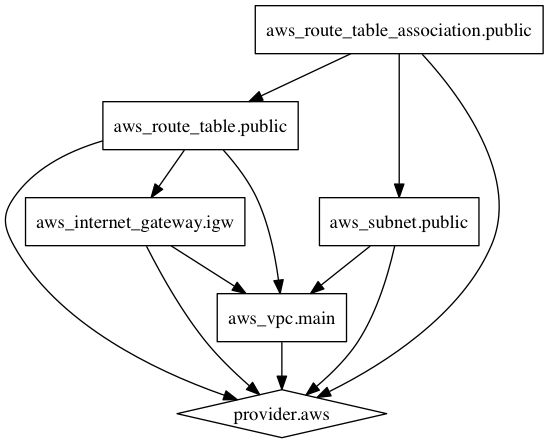

# mod-network

A bare essentials Terraform module to create an AWS network. Including VPC, public subnets, and a single routing table.

I advise against using this for any production applications. Consider this a framework for a hobbyist project or getting started on something bigger - faster!

*Private subnets have been excluded to save cost on both a NAT instance and Bastion/VPN instance.*

## Getting started

Add the module resource into the `main.tf` file in your Terraform project.

``` hcl
module "network" {
  source = "github.com/benmcrae/mod-network?ref=v0.2.0"
  tag_environment = "dev"
  tag_project = "my_first_project"
}
```

Within the root project directory

1. `terraform get` - download module
2. `terraform plan` - create execution plan
3. `terraform apply` - apply changes

*Currently `mod-network` requires an AWS Region with 3 Availability Zones or more.*

### Graph



## Further use

At this stage you may want to create additional resources dependant on this module.
